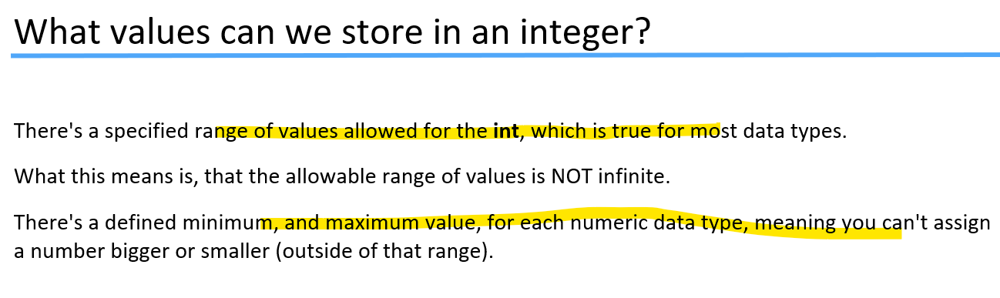
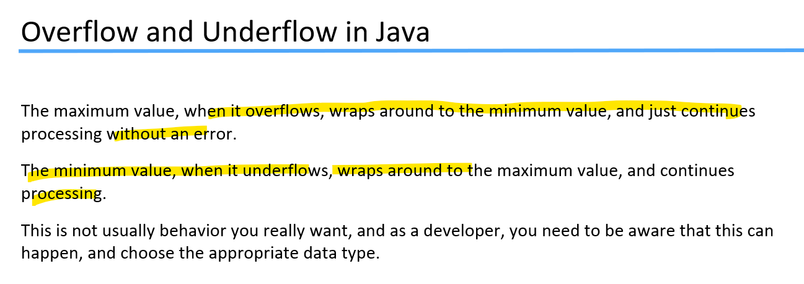
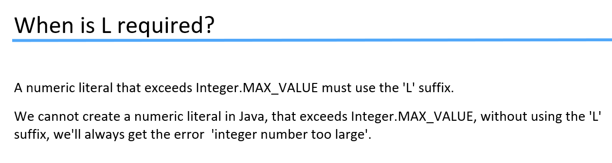
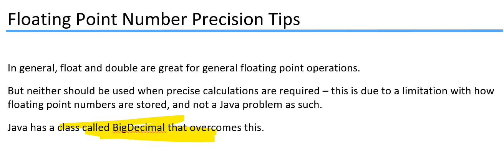

# ***Section-1 Getting Started***
# 1. Introduction to the course.

# 2. Remaster in process

# 3. Video Quality
About video quality 1080p etc
# 4. Subtitiles
English language subtitiles are hand written rest other language is m/c generated.
# 5. How to Get help
How to search question in current lecture or all lecture that will be highlighted here. Also how to ask question and paste your code and sometime image.
# 6. Important Tip: Source Code

# 7. Biggest tip to succeed as a Java programmer.

To be persistent.  
You're finding your way to becoming a programmer.
It is a journey that can be frustrating at times.  
You may even want to give up at times, but the people who succeed as a programmer work
through that and come out the other side as programmers.  
That's just the nature of learning to program.  
Rewarding most definitely but frustrating at times.
You get frustrated because things aren't coming to you naturally.  
Still, over time, you get better and better at programming, and things will make a lot more sense.

# 7.1 The Number-1 skill you need to have become a s/w devloper.
U need to show persistence to succeed as a programmer.    
persist - दृढ रहना / लगा रहना  continuing without change in function or structure  
Pgming ki journey bahut frustated hi hai, aap kiska concept dekhonge usse apply nhi kar pate starting pe..   
ya some of the things are not work.   
But all this are natural part of programmer.  
### Slogan rat lo  
***I am not going to give up until i master this particular thing***
Something overwhelming --> is very intense and hard to deal with:   
-- overwhelming events make people worried and stressed out.  
 It's hard to overcome overwhelming things.  
-->     If you feel an overwhelming need to laugh, you're probably going to laugh.   
-->If you have an overwhelming feeling of sadness, you'll probably cry.

https://learnprogramming.academy/programming/struggling-with-programming-read-this-now/
### ragequit
--> angrily abandon an activity or pursuit that has become frustrating, especially the playing of a video game.
### Mordor 
--> is the realm and base of the evil Sauron = ghinouna. 
### Orcs  
--> a mythical creature (as a sea monster, giant, or ogre) of horrid form or aspect.
### hiccups 
-->रुकावटें / हिचकी
#### Any skill takes time to learn, and more time to master.  Be persistence, and keep moving forward.

https://www.youtube.com/watch?v=vsg5P40x8xo&list=PLXtTjtWmQhg1YRG0L0dIT5B22Utujaq20&index=7
# 7.2 Four stages of becoming a programmer.

aapko pgm sikhna hai to uske liye kya kya padhna honga..  
--> eg- web devloper ke liye kya karna hota hia.. nil bate sannnta.  
-->aapko pata nhi hai ki syntax kya hai.. kaise coding karte hai.. usme concept kya hia..   
--> abhi sare answer aapke pass nhi hai.. 
aapko 1 course finish karna hia.. then go to next..

ab aapko pata chal gya hia ki hume kya padhna hai  
-->eg- Web devloper ko basic mein html, css and javascript aane ko hona.. Uske upar frameworks build hia..  
So you practice to learning that stuff become frustrate by committing mistake so often..

abhi aap sikhne lage.. apne book ya course purchase kiya..   
-->abhi code bhi chal riya hia   
--> chije samjh aa rahi hia  
--> but practice bhi suru hai conciously.

Bahut practice kari apne so that

https://www.youtube.com/watch?v=VHAXJxcHA1k&list=PLXtTjtWmQhg1YRG0L0dIT5B22Utujaq20&index=83
# 8.  Software Tool Introduction

# 9. Which version of Java?

# ***Section-2 Programming Tool Setup***
# 10. Install Jdk 17 for windows
### gotcha 
- I have got you

# 13. Configuring installation and intro to Jshell
### Open command prompt =   
   - type java -version to check version of java
### For writing java code
 - U can use notepad but here you have to compile and run java code manually
 - IntelliJ code editor
### We can execute java command from terminal
 - open cmd and type java -version in order to fetch version of java
 - type java you will get list of multiple java commands.  

 
 #### eval
  -  computer programming function. Related to "evaluation"
  
  https://docs.oracle.com/en/java/javase/17/jshell/introduction-jshell.html#GUID-630F27C8-1195-4989-9F6B-2C51D46F52C8
  ### Open cmd and type jshell
  

### ctr + c se bahar and /exit se pura bahar
# ***Section-3:First Step***
# 14. Hello World
emulates   
- to try to do something as well as, or better than, somebody  
- किसी के बराबर होने या उससे आगे बढ़ने की चेष्‍टा करना

nuances 
  - a very small difference in meaning, feeling, sound, etc.  
 - अर्थ, मनोभाव, ध्वनि आदि में सूक्ष्‍म अंतर
 ### Print Hello World! using Jshell
 
 System.out.println("Hello World!"); is a ***Statement*** in java.
 ### What is statement?
 It's a complete command to be executed. It can include one or more expressions. 
 
 ### Don't forget that Java is write once run anywhere, and that little java pgm you just write can be executed on any device that runs java.
 ### Remember that in JShell, you can see the history of the lines you've previously typed, using the up and down arrows.
### Next, I'll remove the closing parentheses, to see what JShell does:

OK, so what does this somewhat weird-looking new prompt mean?   
Well, JShell is assuming we haven't finished typing in all of the code (since we haven't closed the parentheses set),  
so it waits for us to type something in. I can now go ahead and add the closing  
parentheses here on this line, and the semi-colon (completing the statement), then press enter:

### Remember that the key combination 'control c', on windows, or 'control d' on a mac or a linux machine, should cancel what you are in the middle of, and get you back to the JShell prompt.
### Typing forward slash and the word 'exit', or forward slash with the shortcut text ex, will end your JShell session, if you get stuck.
### An example would be /exit or /ex.

# 15 Variables

https://docs.oracle.com/javase/specs/jls/se17/html/jls-3.html#jls-3.9

### The highlighted keyword are primitive data type.

### Now a variable, as the name suggests, can be changed – in  other words, its contents are variable.
 ### So what we have to do, is tell the computer what type of information we want to store in the variable, and then give the variable a name.
 
 
 ### So here, we've defined our first variable – by specifying a data type of int, and giving the variable the name of myFirstNumber.
 ##  = is an assignment operator
 ## ; tells the java this line/statement is complete.
 
 omitted 
  - to leave out or leave unmentioned
### If you're initializing a variable in the declaration statement, what you type to the right of the equals sign,is assigned as the value of the variable. This is known – the part of the statement that follows the equals sign – as an expression in Java.

### Also the java is taking care to store this number 5 in memory location and aap usko access kar sakte ho apke declare name i.e myFirstNumber se.
in essence 
 - basically and without regard for peripheral details; fundamentally.

essence 
  - the basic or most important quality of something

### aapne abhi declaration statement mein variable ki value initialize ki hai.. aap value baad mein bhi initialize kar sakte.
### Change variable value from 5 to 10

### Jiase aapne declare kiye myFirstNumber ye variable name hai, uske andar aap int type ka data rakh sakte ho ... abhi uski value 5 hai.. kal aap 10 se bhi change kar sakte ho.. that's variable

### ab tak aapne joh bhi command type kiye jshell par aap usse /list karke dekh sakte

### Jshell aur java compiler mein diff kya hia.. 
#### App redeclare kar sakte ho variable ko jshell mein but java compiler error marta.

### Note that we can assign a value to a variable multiple times in Java, but it’s the declaration (which includes the data type) that cannot normally be done a second time for the same variable.

#### Yaha + , * ye operator hai

# 16. Starting out with Expression

review 
 - उस पर पुनर्विचार
 
 
 ### aapne kitne variable ab tak jshell mein banaye hai- iske liye /var
 
 ### aap variable ko expression mein use kar sakte aur kisi naye variable ko assign bhi kar sakte.
 
 
 

# 17. Primitive Types

bust 
 - to break or damage something so that it cannot be used

### If we assigning a literal number that's outside of the valid range for a variable, will throw an error.
aapne 2147483647 ye joh integer ki max range hia usme +1 add karke  
 int variable ko allot kiya i.e 2147483648   
 so we get error

# 18. byte, short, long and width

### long myLongValue = 100;
By default int datatype ke range mien hai ye.. to make it long add suffix l or L at end.

Long datatype has a width of 64

#### waise long value ko aapko L suffix lagana chaiye but aap yadi nhi lagate..So java by default consider 100 as int and long mein int aasani se fit hota.So  yaha error nhi aavenga. 
#### But yadi aap badi value jo int range ke bahar hai uspar bina suffix L lagaye likhenge so compiler will give error.

### aap int ke range ki value yadi short datatype mein baithonge simply compiler error marenga.

# 19. Casting in Java.

### Aap ek line mein multiple datatype define kar sakte, basharte semicolon ho

### Aap 2 variable single statement mein declare kar sakte, Barsharte single datatype jo start mein ho and separated by comma(,)

### Let's break the rule & see what happen
### 1. rule

### 2nd rule

### Let's do some Math

Yaha java compiler confuse ho gya ki ye expression evaluate ho payenga kya.  
#### Yadi aap number specify karte literal ka to compiler evalate kar leta.

### Remember Java by default expression division ko int consider karta karke ye error aaya; I.e default whole number use by java is int.

### So solution is casting  

#### so hum yaha java ko bol rahe aap default consideration int ko choodo and yaha specific is expression ko byte treat karke evaluate karo.

### Remember  casting badi value ko chote datatype me jab fit karna hota hia tab use hoti hai. 
### Humne dekha hai ki int ki max value long mein aasani se fit ho gyi without any casting.
# 20. Primitive type challange

### 1st way

### 2nd way

### Remember that 'L' is optional if the value is less than the integer maximum value. 
### Also notice how we didn't need to do any casting.    This is because the right side produced a long, because we used a long literal in the first part of the equation, so in this instance, the result is a long.

#### Why error?
We require short but we found an int. So here Casting is required.
 
# 21. Float and Double Primitive

### When we talk about floating point numbers, we talk about both the width and the precision of the type.

### 10 to the power -1 = 0.1 & 10 to the power of -5 = 0.00001

outweigh
 - to be more in amount or importance than something
 ### We can assign integer literal to float and double, nothing to worry about suffix.
 
 ### yaha assign integer literal mein proper suffix lagane par bhi same result.
 
 ### Ab 5.25 ye assing karke dekho
 
### Yaha floating number mein default datatype Double hai. isiliye upar ka error aa raha hia..U need to provide proper suffix.

### Remember: the format of the cast is the name of the data type you want to convert to.

innocous 
 -  harmless
 
 # 22. Floating Point Precision and a challenge.
 
 
 
 #### In below eg, you divide (myIntValue = 5 /2) so java compile the result is in int dataformat so ignore fraction part. Which was not in the case of flaot and double things.
 
 ### Float mein 7 decimal aaya  & double mein 16 decimal place. Actually output memory itna store hua hai..That's why we take double.
 
 ### Remembering that Java will automatically look at a decimal number, and assume it's a double.
 
 ### So, as long as one of the operands is a double, your result will be a double.
 
 ### Remember this won't work with float variable
 Float is a single precision number and double provides dobule precision.
 
 
arbitrary 
 - not seeming to be based on any reason or plan and sometimes seeming unfair
 - बिना तर्क, नियम या योजना पर आधारित और कभी-कभी अनुचित; मनमाना, स्‍वेच्‍छाचारी  

consistency
  - the quality of always behaving or performing in a similar way, or of always happening in a similar way
  
  ### Yaha caluclation ke waqt suffix mein d lagana jaruri nhi tha.. kyuki by default double hi consider honga.. but we do it for consistency.
  https://www.google.com/search?q=200+pounds+in+kg&rlz=1C1PRFI_enPH986PH986&oq=200+pounds+in+kg&aqs=chrome..69i57j0i22i30l9.1482j0j7&sourceid=chrome&ie=UTF-8
  ### aap aisa bhi dekh sakte ho- sab valid hai ie underscore in double
  
  
  # 23 The char and  boolean primitive datatype
   

